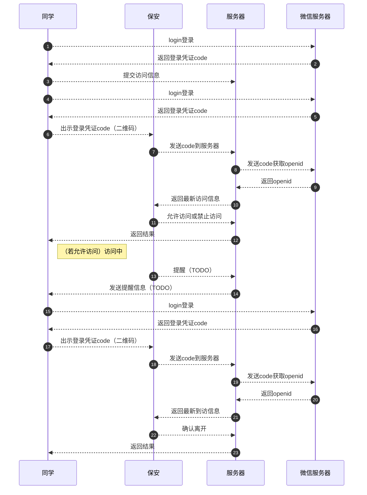

```mermaid
sequenceDiagram
  # 通过设定参与者(participants)的顺序控制展示模块顺序
  autonumber
  participant 同学
　participant 保安
　participant 服务器
　participant 微信服务器
　同学 -->> 微信服务器:login登录
　微信服务器 -->> 同学:返回登录凭证code
　同学 -->> 服务器:提交访问信息
　同学 -->> 微信服务器:login登录
　微信服务器 -->> 同学:返回登录凭证code
　同学 -->> 保安:出示登录凭证code（二维码）
　保安 -->> 服务器:发送code到服务器
　服务器 -->> 微信服务器:发送code获取openid
　微信服务器 -->> 服务器:返回openid
　服务器 -->> 保安:返回最新访问信息
　保安 -->> 服务器:允许访问或禁止访问
　服务器 -->> 同学:返回结果
　Note right of 同学:（若允许访问）访问中
　保安 -->> 服务器:提醒（TODO）
　服务器 -->> 同学:发送提醒信息（TODO）
　同学 -->> 微信服务器:login登录
　微信服务器 -->> 同学:返回登录凭证code
　同学 -->> 保安:出示登录凭证code（二维码）
　保安 -->> 服务器:发送code到服务器
　服务器 -->> 微信服务器:发送code获取openid
　微信服务器 -->> 服务器:返回openid
　服务器 -->> 保安:返回最新到访信息
　保安 -->> 服务器:确认离开
　服务器 -->> 同学:返回结果
　
　
```

