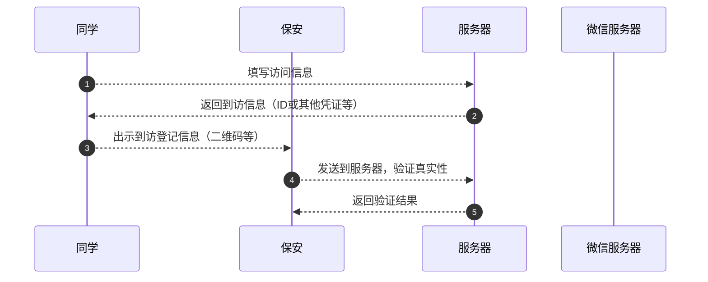

```mermaid
sequenceDiagram
  # 通过设定参与者(participants)的顺序控制展示模块顺序
  autonumber
  participant 同学
　participant 保安
　participant 服务器
　participant 微信服务器
　同学 -->> 服务器:填写访问信息
　服务器 -->> 同学:返回到访信息（ID或其他凭证等）
　同学 -->> 保安:出示到访登记信息（二维码等）
　保安 -->> 服务器:发送到服务器，验证真实性
　服务器 -->> 保安:返回验证结果
　
　
```

