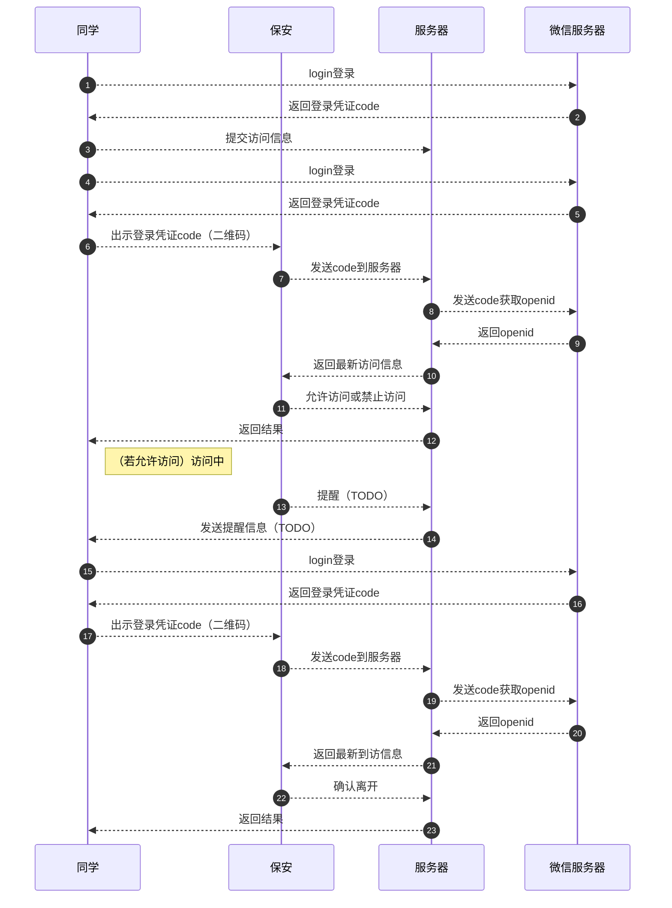
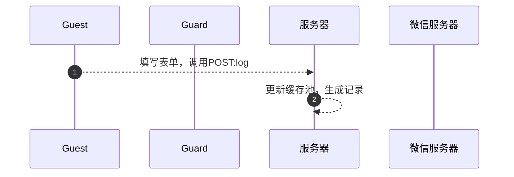
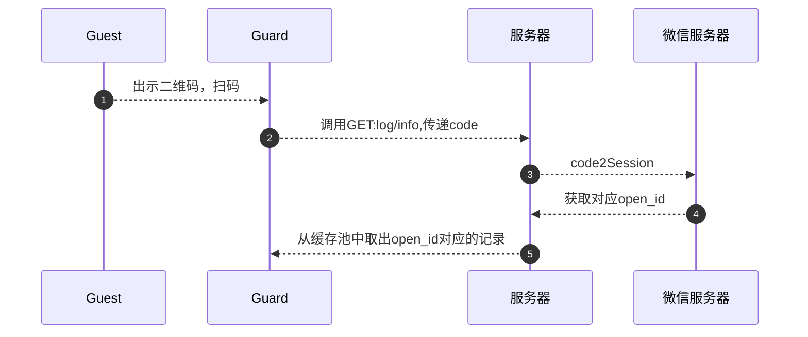
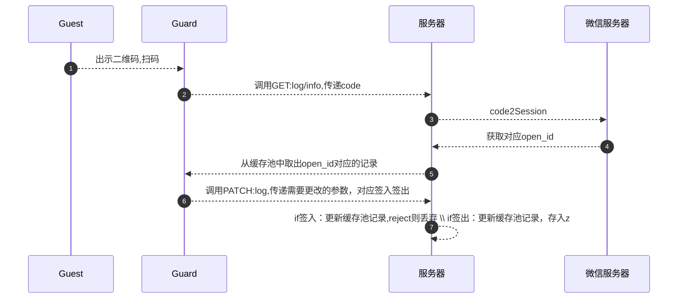

```mermaid
sequenceDiagram
  # 通过设定参与者(participants)的顺序控制展示模块顺序
  autonumber
  participant 同学
　participant 保安
　participant 服务器
　participant 微信服务器
　同学 -->> 微信服务器:login登录
　微信服务器 -->> 同学:返回登录凭证code
　同学 -->> 服务器:提交访问信息
　同学 -->> 微信服务器:login登录
　微信服务器 -->> 同学:返回登录凭证code
　同学 -->> 保安:出示登录凭证code（二维码）
　保安 -->> 服务器:发送code到服务器
　服务器 -->> 微信服务器:发送code获取openid
　微信服务器 -->> 服务器:返回openid
　服务器 -->> 保安:返回最新访问信息
　保安 -->> 服务器:允许访问或禁止访问
　服务器 -->> 同学:返回结果
　Note right of 同学:（若允许访问）访问中
　保安 -->> 服务器:提醒（TODO）
　服务器 -->> 同学:发送提醒信息（TODO）
　同学 -->> 微信服务器:login登录
　微信服务器 -->> 同学:返回登录凭证code
　同学 -->> 保安:出示登录凭证code（二维码）
　保安 -->> 服务器:发送code到服务器
　服务器 -->> 微信服务器:发送code获取openid
　微信服务器 -->> 服务器:返回openid
　服务器 -->> 保安:返回最新到访信息
　保安 -->> 服务器:确认离开
　服务器 -->> 同学:返回结果
　
　
```

### 启用缓存后的Log操作流程

缓存池使用guest的open_id作为key。value就是log的dict。

**创建Log**

```mermaid
sequenceDiagram
	autonumber
	participant Guest
	participant Guard
	participant 服务器
	participant 微信服务器
	Guest -->> 服务器:填写表单，调用POST:log
	服务器 -->> 服务器: 更新缓存池，生成记录
	
```

**获得Log信息**

```mermaid
sequenceDiagram
	autonumber
	participant Guest
	participant Guard
	participant 服务器
	participant 微信服务器
	Guest -->> Guard:出示二维码，扫码
	Guard -->> 服务器:调用GET:log/info,传递code
	服务器 -->> 微信服务器: code2Session
	微信服务器 -->> 服务器: 获取对应open_id
	服务器 -->> Guard: 从缓存池中取出open_id对应的记录
	
```

**签入/签出**

```mermaid
sequenceDiagram
	autonumber
	participant Guest
	participant Guard
	participant 服务器
	participant 微信服务器
	Guest -->> Guard: 出示二维码,扫码
	Guard -->> 服务器:调用GET:log/info,传递code
	服务器 -->> 微信服务器: code2Session
	微信服务器 -->> 服务器: 获取对应open_id
	服务器 -->> Guard: 从缓存池中取出open_id对应的记录
	Guard -->> 服务器: 调用PATCH:log,传递需要更改的参数，对应签入签出
	服务器 -->> 服务器: if签入：更新缓存池记录,reject则丢弃 \\ if签出：更新缓存池记录，存入z
	
```

